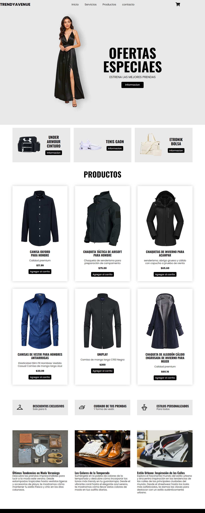

# TrendyAvenue

TrendyAvenue es un sitio web de moda que ofrece una amplia gama de productos y las últimas tendencias en moda veraniega, colores de temporada, descuentos exclusivos y más. 

## Características

- Diseño responsivo para una experiencia óptima en todos los dispositivos.
- Carrito de compras implementado con JavaScript.
- Utiliza la librería Normalize para garantizar una apariencia consistente en diferentes navegadores.
- Cuenta con secciones de ofertas, productos destacados, iconos informativos y un blog con las últimas tendencias en moda.

## Tecnologías Utilizadas

- HTML5
- CSS3
- JavaScript
- Normalize.css

## Capturas de Pantalla

## Instalación

1. Clona este repositorio a tu máquina local.
2. Abre el archivo `index.html` en tu navegador web.
3. ¡Explora las últimas tendencias de moda y disfruta de una experiencia de compra única en TrendyAvenue!

## Autor

Andonys24

## Licencia

Este proyecto está bajo la licencia MIT. Para más detalles, consulta el archivo [LICENSE](/LICENSE).
